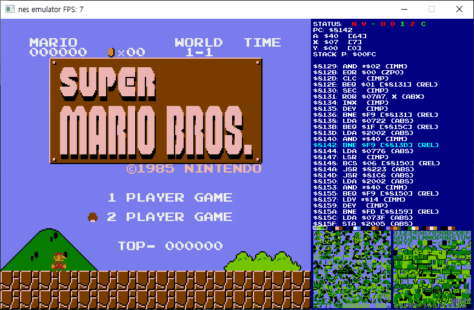
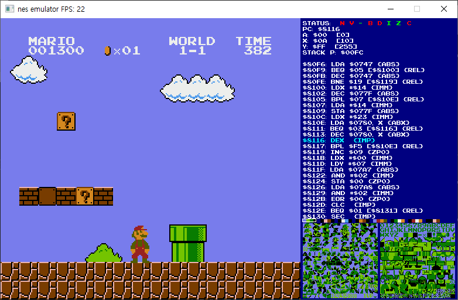

# nes-emulator
일본의 비디오 게임 회사 닌텐도에서 출시한 게임기인 패밀리 컴퓨터(NES)의 에뮬레이터입니다.  
픽셀 단위 출력을 위한 SDL 기반 간단한 엔진도 포함되어 있습니다.  
  
<h3>에뮬레이터</h3>  
다른 프로그램이나 장치를 모방하는 컴퓨터 프로그램 또는 전자기기를 가리키는 용어입니다. 지원되지 않는 하드웨어에서 소프트웨어를 실행하기 위하는 목적으로 널리 쓰입니다.  
에뮬레이터는 하드웨어의 구조를 파악한 뒤에 CPU의 처리 과정과 메모리 전송 등을 전부 소프트웨어적으로 구현하고 컨트롤러의 입력이나 그래픽/사운드 처리는 DirectX 등을 사용하여 구현하는 방식이 주를 이룹니다. 이렇게 만들어진 가상의 기기 위에 실제 게임기의 소프트웨어를 올려서 구동시키는 것이 게임 에뮬레이터가 하는 일입니다.  
이 프로젝트는 NES의 6502 CPU, 2C02 PPU, 카트리지 등을 소프트웨어적으로 구현하고 SDL로 화면을 렌더링합니다.
  
<h3>실행 화면</h3>
  
  

<h3>필수 조건</h3>
SDL - https://www.libsdl.org/  
실행할 게임의 ROM 파일  

<h3>문제점</h3>  
- 오디오 출력이 되지 않으며 에뮬레이터의 속도가 기존의 기기보다 빠를 수 있습니다.  
- 현재 게임 카트리지에 사용되는 메모리 관리 칩인 매퍼(Mapper 혹은 MMC, Memory Management Controller)가 모두 구현되어 있지 않습니다.  
MMC 1만 구현되어 있는 상태입니다. 따라서 해당 칩을 사용하는 카트리지 게임만 플레이 가능합니다.

<h3>참고</h3>  
데이터시트 - http://archive.6502.org/datasheets/rockwell_r65c00_microprocessors.pdf   
Nesdev Wiki - https://wiki.nesdev.org/w/index.php?title=Nesdev_Wiki   
  
<h3>Special Thanks to</h3>  
OneLoneCoder - https://www.youtube.com/c/javidx9/  

<h3>License (OLC-3)</h3>
Copyright 2018, 2019, 2020, 2021 OneLoneCoder.com
  
Redistribution and use in source and binary forms, with or without modification, are permitted provided that the following conditions are met:
  
Redistributions or derivations of source code must retain the above copyright notice, this list of conditions and the following disclaimer.  
  
Redistributions or derivative works in binary form must reproduce the above copyright notice. This list of conditions and the following disclaimer must be reproduced in the documentation and/or other materials provided with the distribution.
  
Neither the name of the copyright holder nor the names of its contributors may be used to endorse or promote products derived from this software without specific prior written permission.
  
THIS SOFTWARE IS PROVIDED BY THE COPYRIGHT HOLDERS AND CONTRIBUTORS "AS IS" AND ANY EXPRESS OR IMPLIED WARRANTIES, INCLUDING, BUT NOT LIMITED TO, THE IMPLIED WARRANTIES OF MERCHANTABILITY AND FITNESS FOR A PARTICULAR PURPOSE ARE DISCLAIMED. IN NO EVENT SHALL THE COPYRIGHT HOLDER OR CONTRIBUTORS BE LIABLE FOR ANY DIRECT, INDIRECT, INCIDENTAL, SPECIAL, EXEMPLARY, OR CONSEQUENTIAL DAMAGES (INCLUDING, BUT NOT LIMITED TO, PROCUREMENT OF SUBSTITUTE GOODS OR SERVICES; LOSS OF USE, DATA, OR PROFITS; OR BUSINESS INTERRUPTION) HOWEVER CAUSED AND ON ANY THEORY OF LIABILITY, WHETHER IN CONTRACT, STRICT LIABILITY, OR TORT (INCLUDING NEGLIGENCE OR OTHERWISE) ARISING IN ANY WAY OUT OF THE USE OF THIS SOFTWARE, EVEN IF ADVISED OF THE POSSIBILITY OF SUCH DAMAGE.
